# 상품 AI 다크팩토리 — 데이터베이스 설계서

> 본 문서는 현재 구현된 프로토타입(상품 설계 도구 / VNB 시뮬레이터 / 자동 문서 생성기 / VNB Assistant)의
> 화면·상태(state)·목업 데이터 구조를 분석하여 도출한 **운영 전환용 데이터베이스 설계**입니다.
> 현재 프론트엔드는 React Context(`contexts/product-context.tsx`) 기반 인메모리 상태로 동작하며,
> 아래 스키마는 이를 영속 저장소(PostgreSQL 기준)로 전환할 때의 권장 설계입니다.

- 작성 기준일: 2026-06-07
- 대상 DBMS: PostgreSQL 15+ (스키마는 표준 SQL 기준, 필요 시 Aurora/Neon 호환)
- 식별자 표기: `상품설계ID(PDID)` = `PD-YYYYMMDD-HHmm` 형식

---

## 1. 도메인 개요

시스템은 크게 5개의 기능 도메인으로 구성됩니다.

| 도메인 | 설명 | 주요 화면 |
|--------|------|-----------|
| **상품 설계 (Product Design)** | 담보 블록 조합으로 신규/보유 상품을 설계·관리 | 상품 설계 도구, 상품 요약 |
| **수익성 분석 (Profitability)** | VNB 시뮬레이션 및 수익성 이슈/개선 권고 관리 | VNB 시뮬레이터, 포트폴리오 히트맵 |
| **규제 문서 (Regulatory Docs)** | 사업방법서·약관 등 AI 자동 생성 문서 관리 | 자동 문서 생성기 |
| **VNB Assistant (ML Pipeline)** | 학습용 DB → 예측모델 → 예측결과 집계 파이프라인 | VNB Assistant 대시보드 |
| **기초율·산출기반 (Actuarial Basis)** | PV/VNB 산출에 필요한 모든 구성 DB — 기초율(위험률/이율/사업비/해지율)·담보모델링·환산율·MP·산출로직·룰·코드정의·외부연계 | (백엔드 산출 엔진/연계 배치) |

> **설계 원칙 (기초율·산출기반 도메인)**
> 1. **PV/VNB 산출에 필요한 모든 구성 요소를 DB화**: 기초율 DB(위험률/이율/사업비/해지율), 담보모델링 DB, 환산율 DB, MP(계약가입조건) DB를 분리·표준화하여 적재.
> 2. **로직별 DB화(기간 및 코드정의) 및 룰 DB화**: 산출 로직과 비즈니스 룰을 코드/버전/유효기간(effective period)으로 관리하여 과거 시점 재현 및 개정 추적 가능.
> 3. **내부 계약/결산 시스템과의 데이터 연계 고려**: 모든 기준 DB에 `source_system`/연계 메타를 부여하고, `external_interface`·`interface_log`로 정기배치/실시간 연계를 관리.
> 4. **MP DB는 과거 결산정보/계약정보를 가져올 수 있음**: `model_point`는 신규 생성(가입가능 범위 전개)뿐 아니라 결산/계약 시스템에서 적재된 실적 기반 모델포인트를 함께 보관(`origin` 구분).

---

## 2. High-Level ERD

```mermaid
erDiagram
    USER ||--o{ PRODUCT : "owns"
    PRODUCT ||--o{ COVERAGE_BLOCK : "contains"
    PRODUCT ||--o{ PROFITABILITY_ISSUE : "has"
    PRODUCT ||--o{ VNB_SIMULATION : "evaluated_by"
    PRODUCT ||--o{ REGULATORY_DOCUMENT : "generates"
    PRODUCT ||--o| PRODUCT : "derived_from (개선안)"
    VNB_SIMULATION ||--o| SUBMITTED_SIMULATION : "promoted_to"

    PRODUCT_CATEGORY ||--o{ PRODUCT : "classifies"

    %% ---- VNB Assistant ML Pipeline ----
    TRAINING_VARIABLE_GROUP ||--o{ TRAINING_DATASET : "describes"
    TRAINING_DATASET ||--o{ PREDICTION_MODEL : "trains"
    PREDICTION_MODEL ||--o{ MODEL_SHAP_IMPORTANCE : "explains"
    PREDICTION_MODEL ||--o{ MODEL_PERFORMANCE_LOG : "monitored_by"
    PREDICTION_MODEL ||--o{ VNB_PREDICTION : "produces"
    VNB_PREDICTION ||--o{ PREDICTION_AGGREGATION : "aggregated_into"
    PRODUCT ||--o{ VNB_PREDICTION : "scoped_by"

    %% ---- Actuarial Basis (기초율·산출기반) ----
    ASSUMPTION_SET ||--o{ ASSUMPTION_RATE : "contains"
    COVERAGE_MODEL ||--o{ COVERAGE_MODEL_PARAM : "parameterized_by"
    CONVERSION_RATE_SET ||--o{ CONVERSION_RATE : "contains"
    MODEL_POINT_SET ||--o{ MODEL_POINT : "contains"
    CALC_LOGIC ||--o{ CALC_RULE : "composed_of"
    EXTERNAL_INTERFACE ||--o{ INTERFACE_LOG : "logs"
    EXTERNAL_INTERFACE ||--o{ MODEL_POINT_SET : "feeds"
    PRODUCT ||--o{ MODEL_POINT_SET : "scoped_by"
    ASSUMPTION_SET ||--o{ VNB_SIMULATION : "applied_in"
    CALC_LOGIC ||--o{ VNB_SIMULATION : "computed_by"

    USER {
        uuid id PK
        string email
        string display_name
    }
    PRODUCT {
        uuid id PK
        string pdid UK "PD-YYYYMMDD-HHmm"
        string name
        uuid category_id FK
        uuid owner_id FK
        uuid source_product_id FK "개선안 원본"
        boolean is_existing
        bigint estimated_vnb
    }
    COVERAGE_BLOCK {
        uuid id PK
        uuid product_id FK
        string type "main|rider|waiver"
    }
    PROFITABILITY_ISSUE {
        uuid id PK
        uuid product_id FK
        string factor
        string severity
        boolean is_recommendation
    }
    VNB_SIMULATION {
        uuid id PK
        uuid product_id FK
        string simulation_id
        numeric vnb
    }
    REGULATORY_DOCUMENT {
        uuid id PK
        uuid product_id FK
        string document_type
        string status
    }
    PREDICTION_MODEL {
        uuid id PK
        string model_code UK
        uuid training_dataset_id FK
        numeric accuracy
    }
    VNB_PREDICTION {
        uuid id PK
        uuid model_id FK
        uuid product_id FK
        numeric predicted_vnb
    }
    ASSUMPTION_SET {
        uuid id PK
        string assumption_type "위험률|이율|사업비|해지율"
        string version
        date effective_from
        date effective_to
        string source_system
    }
    ASSUMPTION_RATE {
        uuid id PK
        uuid assumption_set_id FK
        string key_code
        numeric rate_value
    }
    COVERAGE_MODEL {
        uuid id PK
        string coverage_code
        string version
        date effective_from
    }
    CONVERSION_RATE_SET {
        uuid id PK
        string version
        date effective_from
    }
    MODEL_POINT_SET {
        uuid id PK
        uuid product_id FK
        string origin "generated|settlement|policy"
        string source_system
    }
    MODEL_POINT {
        uuid id PK
        uuid model_point_set_id FK
        string channel
        numeric premium
    }
    CALC_LOGIC {
        uuid id PK
        string logic_code
        string version
        date effective_from
    }
    CALC_RULE {
        uuid id PK
        uuid calc_logic_id FK
        string rule_code
        string expression
    }
    EXTERNAL_INTERFACE {
        uuid id PK
        string interface_code
        string direction "inbound|outbound"
        string sync_type "정기배치|실시간"
    }
```

### 2.1 관계 요약

- **USER 1 — N PRODUCT**: 설계자(owner)가 다수 상품을 보유
- **PRODUCT 1 — N COVERAGE_BLOCK**: 상품은 주계약/특약/보험료납입면제 담보 블록으로 구성
- **PRODUCT 1 — N PROFITABILITY_ISSUE**: 수익성 이슈 및 개선 권고(`is_recommendation`)를 함께 저장
- **PRODUCT 1 — N VNB_SIMULATION**: 위험률·해지율·사업비 등 시나리오별 시뮬레이션 이력
- **PRODUCT 0..1 — PRODUCT (self)**: "개선안" 상품은 `source_product_id`로 원본 상품 참조
- **PREDICTION_MODEL 1 — N VNB_PREDICTION**: 증번/보종 단위 모델이 예측 결과 생성
- **VNB_PREDICTION N — 1 PRODUCT**: 예측은 특정 상품(설계 단위)에 귀속

#### 기초율·산출기반 도메인 관계

- **ASSUMPTION_SET 1 — N ASSUMPTION_RATE**: 기초율 집합(위험률/이율/사업비/해지율)은 유효기간·버전 단위로 관리되고, 세부 율값(연령·성별·경과기간별)을 다수 보유
- **COVERAGE_MODEL 1 — N COVERAGE_MODEL_PARAM**: 담보모델링 DB는 담보 코드·버전별로 산출 파라미터를 보유
- **CONVERSION_RATE_SET 1 — N CONVERSION_RATE**: 환산율 DB는 버전·유효기간별 환산율을 보유
- **MODEL_POINT_SET 1 — N MODEL_POINT**: MP DB. 가입가능 범위 전개(`generated`)뿐 아니라 결산/계약 시스템에서 적재된 실적 모델포인트(`settlement`/`policy`)도 보관
- **CALC_LOGIC 1 — N CALC_RULE**: 산출 로직은 코드·기간 정의 기반으로 룰을 구성(룰 DB화)
- **EXTERNAL_INTERFACE 1 — N INTERFACE_LOG**: 내부 계약/결산 시스템과의 정기배치/실시간 연계 정의 및 실행 로그
- **ASSUMPTION_SET / CALC_LOGIC — VNB_SIMULATION**: 시뮬레이션은 특정 기초율 집합·산출 로직 버전을 참조하여 과거 시점 재현 가능

---

## 3. 상세 테이블 설계

### 3.1 공통 코드 / 기준 테이블

#### `user` — 사용자
| 컬럼 | 타입 | 제약 | 설명 |
|------|------|------|------|
| id | UUID | PK | 사용자 식별자 |
| email | VARCHAR(255) | UNIQUE, NOT NULL | 로그인 이메일 |
| display_name | VARCHAR(100) | NOT NULL | 표시 이름 (예: "상품개발팀") |
| created_at | TIMESTAMPTZ | NOT NULL DEFAULT now() | 생성 시각 |

#### `product_category` — 상품 카테고리
| 컬럼 | 타입 | 제약 | 설명 |
|------|------|------|------|
| id | UUID | PK | 카테고리 식별자 |
| code | VARCHAR(40) | UNIQUE, NOT NULL | 코드값 |
| name | VARCHAR(40) | NOT NULL | 헬스케어보장 / 종신보험 / 연금저축보험 / 기타 |

---

### 3.2 상품 설계 도메인

#### `product` — 상품 (설계/보유 통합)
| 컬럼 | 타입 | 제약 | 설명 |
|------|------|------|------|
| id | UUID | PK | 내부 식별자 |
| pdid | VARCHAR(20) | UNIQUE | 상품설계ID, `PD-YYYYMMDD-HHmm` |
| name | VARCHAR(120) | NOT NULL | 상품명 |
| description | TEXT | | 상품 설명 |
| category_id | UUID | FK → product_category.id | 카테고리 |
| owner_id | UUID | FK → user.id | 설계 담당자 |
| source_product_id | UUID | FK → product.id (NULLABLE) | 개선안 원본 상품 |
| is_existing | BOOLEAN | NOT NULL DEFAULT false | true=보유상품, false=신규설계 |
| product_type | VARCHAR(60) | | 세부 상품유형 (예: 일반암보험) |
| target_age_group | VARCHAR(20) | | 타겟 연령대 (예: 30대) |
| estimated_vnb | BIGINT | | 예상 VNB (원) |
| profitability_status | VARCHAR(10) | CHECK (high/medium/low) | 수익성 등급 |
| created_at | TIMESTAMPTZ | NOT NULL DEFAULT now() | 설계 생성 시각 |
| updated_at | TIMESTAMPTZ | | 수정 시각 |

> 인덱스: `idx_product_owner(owner_id)`, `idx_product_category(category_id)`, `idx_product_source(source_product_id)`

#### `coverage_block` — 담보 블록
| 컬럼 | 타입 | 제약 | 설명 |
|------|------|------|------|
| id | UUID | PK | 담보 블록 식별자 |
| product_id | UUID | FK → product.id, NOT NULL | 소속 상품 |
| type | VARCHAR(10) | CHECK (main/rider/waiver) | 주계약/특약/납입면제 |
| name | VARCHAR(120) | NOT NULL | 담보명 |
| coverage_amount | BIGINT | | 가입금액 (원) |
| age_min | SMALLINT | | 가입 최소 연령 |
| age_max | SMALLINT | | 가입 최대 연령 |
| display_order | SMALLINT | | 정렬 순서 (드래그 순서) |

> 인덱스: `idx_coverage_product(product_id)`

---

### 3.3 수익성 분석 도메인

#### `profitability_issue` — 수익성 이슈 / 개선 권고
| 컬럼 | 타입 | 제약 | 설명 |
|------|------|------|------|
| id | UUID | PK | 식별자 |
| product_id | UUID | FK → product.id, NOT NULL | 대상 상품 |
| factor | VARCHAR(40) | NOT NULL | 위험률/사업비/해지율/할인율 등 |
| severity | VARCHAR(10) | CHECK (high/medium/low) | 심각도 |
| description | TEXT | | 이슈 설명 |
| impact | NUMERIC(10,2) | | VNB 영향도 (억원) |
| recommendation | TEXT | | 개선 권고 |
| is_recommendation | BOOLEAN | NOT NULL DEFAULT false | true=개선안에 전달된 권고 |
| created_at | TIMESTAMPTZ | NOT NULL DEFAULT now() | |

> 인덱스: `idx_issue_product(product_id)`

#### `vnb_simulation` — VNB 시뮬레이션 이력
| 컬럼 | 타입 | 제약 | 설명 |
|------|------|------|------|
| id | UUID | PK | 식별자 |
| product_id | UUID | FK → product.id, NOT NULL | 대상 상품 |
| simulation_id | VARCHAR(40) | NOT NULL | 시뮬레이션 표시 코드 |
| scenario_type | VARCHAR(20) | CHECK (base/conservative/aggressive/custom) | 시나리오 유형 |
| risk_rate | NUMERIC(6,3) | | 위험률 (%) |
| expense | NUMERIC(6,3) | | 사업비율 (%) |
| lapse_rate | NUMERIC(6,3) | | 해지율 (%) |
| discount_rate | NUMERIC(6,3) | | 할인율 (%) |
| premium | BIGINT | | 보험료 (원) |
| vnb | NUMERIC(14,2) | | 산출 VNB |
| margin_rate | NUMERIC(6,3) | | 마진율 (%) |
| is_baseline | BOOLEAN | DEFAULT false | Original 기준값 여부 |
| created_at | TIMESTAMPTZ | NOT NULL DEFAULT now() | 시뮬레이션 시각 |

> 인덱스: `idx_sim_product(product_id)`, `idx_sim_created(created_at)`

#### `submitted_simulation` — 확정 제출 시뮬레이션
| 컬럼 | 타입 | 제약 | 설명 |
|------|------|------|------|
| id | UUID | PK | 식별자 |
| product_id | UUID | FK → product.id, UNIQUE | 상품당 1건 확정 |
| simulation_id | VARCHAR(40) | NOT NULL | 원본 시뮬레이션 코드 |
| risk_rate | NUMERIC(6,3) | | 위험률 |
| expense | NUMERIC(6,3) | | 사업비율 |
| lapse_rate | NUMERIC(6,3) | | 해지율 |
| discount_rate | NUMERIC(6,3) | | 할인율 |
| premium | BIGINT | | 보험료 |
| vnb | NUMERIC(14,2) | | 확정 VNB |
| margin_rate | NUMERIC(6,3) | | 확정 마진율 |
| submitted_at | TIMESTAMPTZ | NOT NULL DEFAULT now() | 제출 시각 |

---

### 3.4 규제 문서 도메인

#### `regulatory_document` — 자동 생성 규제 문서
| 컬럼 | 타입 | 제약 | 설명 |
|------|------|------|------|
| id | UUID | PK | 식별자 |
| product_id | UUID | FK → product.id, NOT NULL | 대상 상품 |
| document_type | VARCHAR(40) | NOT NULL | 사업방법서/보험약관/상품설명서/보험료율 산출서/계리검증 보고서 |
| version | VARCHAR(10) | DEFAULT 'v1.0' | 문서 버전 |
| status | VARCHAR(20) | CHECK (pending/generating/draft/review_needed/calculated/passed/submitted) | 진행 상태 |
| ai_generated | BOOLEAN | NOT NULL DEFAULT true | AI 생성 여부 |
| content | JSONB | | 문서 본문/메타데이터 |
| progress | SMALLINT | DEFAULT 0 | 생성 진행률(%) |
| submitted | BOOLEAN | DEFAULT false | 제출 완료 여부 |
| generated_at | TIMESTAMPTZ | | 생성 완료 시각 |
| submitted_at | TIMESTAMPTZ | | 제출 시각 |

> 인덱스: `idx_doc_product(product_id)`, `idx_doc_type(document_type)`
> 제약: `UNIQUE(product_id, document_type, version)`

---

### 3.5 VNB Assistant — ML 파이프라인 도메인

#### `training_variable_group` — 학습용 설명변수 그룹
| 컬럼 | 타입 | 제약 | 설명 |
|------|------|------|------|
| id | UUID | PK | 식별자 |
| category | VARCHAR(40) | NOT NULL | VNB결산정보/계약가입속성/상품정보/환산정보/최적가정/최소보험료 |
| variable_count | INTEGER | NOT NULL | 설명변수 개수 |
| fields | TEXT | | 대표 필드 목록 |
| sync_type | VARCHAR(10) | CHECK (정기배치/실시간) | 연계 방식 |
| status | VARCHAR(10) | CHECK (active/syncing/error) | 적재 상태 |
| last_synced_at | TIMESTAMPTZ | | 최종 연계 시각 |

#### `training_dataset` — 학습용 데이터셋
| 컬럼 | 타입 | 제약 | 설명 |
|------|------|------|------|
| id | UUID | PK | 식별자 |
| name | VARCHAR(120) | NOT NULL | 데이터셋명 |
| source | VARCHAR(40) | | 생성 출처 (예: VNB산출 엑셀) |
| row_count | BIGINT | | 생성 행 수 |
| period_month | VARCHAR(10) | | 적재 기준월 |
| created_at | TIMESTAMPTZ | NOT NULL DEFAULT now() | |

#### `prediction_model` — 예측 모델
| 컬럼 | 타입 | 제약 | 설명 |
|------|------|------|------|
| id | UUID | PK | 식별자 |
| model_code | VARCHAR(40) | UNIQUE, NOT NULL | 모델 코드 (예: M-CANCER-001) |
| name | VARCHAR(120) | NOT NULL | 모델명 |
| training_dataset_id | UUID | FK → training_dataset.id | 학습 데이터셋 |
| unit | VARCHAR(20) | CHECK (증번단위/보종단위) | 예측 단위 |
| algorithm | VARCHAR(40) | | XGBoost/LightGBM/CatBoost/DNN 등 |
| accuracy | NUMERIC(5,2) | | 정확도(%) |
| r2 | NUMERIC(5,3) | | 결정계수 |
| hyperparameters | JSONB | | 하이퍼파라미터 (재현용) |
| preprocessing | JSONB | | 전처리 로직 메타 (재현용) |
| status | VARCHAR(20) | CHECK (운영중/재학습중/검증중/폐기) | 모델 상태 |
| last_trained_at | DATE | | 최종 학습일 |

> 인덱스: `idx_model_status(status)`

#### `model_shap_importance` — SHAP 변수 중요도
| 컬럼 | 타입 | 제약 | 설명 |
|------|------|------|------|
| id | UUID | PK | 식별자 |
| model_id | UUID | FK → prediction_model.id, NOT NULL | 대상 모델 |
| variable | VARCHAR(40) | NOT NULL | 설명변수명 |
| impact | NUMERIC(5,3) | | SHAP 영향도 |

> 인덱스: `idx_shap_model(model_id)`

#### `model_performance_log` — 모델 성능 모니터링
| 컬럼 | 타입 | 제약 | 설명 |
|------|------|------|------|
| id | UUID | PK | 식별자 |
| model_id | UUID | FK → prediction_model.id, NOT NULL | 대상 모델 |
| measured_at | DATE | NOT NULL | 측정 기준일 |
| rmse | NUMERIC(8,3) | | RMSE |
| mape | NUMERIC(6,3) | | MAPE(%) |
| r2 | NUMERIC(5,3) | | 결정계수 |
| retrain_triggered | BOOLEAN | DEFAULT false | 재학습 트리거 발생 여부 |

> 인덱스: `idx_perf_model_date(model_id, measured_at)`

#### `vnb_prediction` — 예측 결과 저장 (예측결과저장DB)
| 컬럼 | 타입 | 제약 | 설명 |
|------|------|------|------|
| id | UUID | PK | 식별자 |
| prediction_code | VARCHAR(40) | NOT NULL | 예측 표시 코드 (예: PRED-0612-001) |
| model_id | UUID | FK → prediction_model.id, NOT NULL | 사용 모델 |
| product_id | UUID | FK → product.id (NULLABLE) | 대상 상품 |
| product_label | VARCHAR(120) | | 상품/보종 표시명 |
| channel | VARCHAR(20) | | 채널 (GA/방카/TM/대면) |
| gender | VARCHAR(4) | | 성별 |
| age | SMALLINT | | 가입연령 |
| coverage_amount | BIGINT | | 가입금액 |
| mp_count | INTEGER | | MP DB 건수 |
| predicted_vnb | NUMERIC(14,2) | | 예측 VNB |
| predicted_ape | NUMERIC(14,2) | | 예측 APE |
| margin_rate | NUMERIC(6,3) | | 마진율(%) |
| predicted_at | TIMESTAMPTZ | NOT NULL DEFAULT now() | 예측 시각 |

> 인덱스: `idx_pred_model(model_id)`, `idx_pred_product(product_id)`, `idx_pred_channel(channel)`

#### `prediction_aggregation` — 예측 집계 결과
| 컬럼 | 타입 | 제약 | 설명 |
|------|------|------|------|
| id | UUID | PK | 식별자 |
| aggregation_unit | VARCHAR(20) | CHECK (증번/보종/상품/MIX/채널) | 집계 단위 |
| unit_key | VARCHAR(60) | NOT NULL | 단위 값 (예: 암보험, GA) |
| forecast_vnb | NUMERIC(14,2) | | 예측 VNB 합계 |
| settlement_vnb | NUMERIC(14,2) | | 결산 VNB (비교 기준) |
| period | VARCHAR(20) | | 집계 기간 |
| created_at | TIMESTAMPTZ | NOT NULL DEFAULT now() | |

> 인덱스: `idx_agg_unit(aggregation_unit, unit_key)`

---

### 3.6 기초율·산출기반 도메인 (Actuarial Basis)

> PV/VNB 산출에 필요한 모든 구성 DB. 모든 기준 테이블은 **버전(version) + 유효기간(effective_from/to)**으로
> 관리하여 과거 시점 재현·개정 추적이 가능하며, `source_system`으로 내부 계약/결산 시스템 연계 출처를 식별합니다.

#### `assumption_set` — 기초율 집합 (위험률/이율/사업비/해지율 DB)
| 컬럼 | 타입 | 제약 | 설명 |
|------|------|------|------|
| id | UUID | PK | 식별자 |
| assumption_type | VARCHAR(20) | CHECK (risk/interest/expense/lapse), NOT NULL | 위험률/이율/사업비/해지율 |
| name | VARCHAR(120) | NOT NULL | 기초율 집합명 |
| version | VARCHAR(20) | NOT NULL | 버전 (예: 2026.1) |
| effective_from | DATE | NOT NULL | 적용 시작일 |
| effective_to | DATE | | 적용 종료일 (NULL=현행) |
| source_system | VARCHAR(40) | | 연계 출처 시스템 (예: 계리/결산) |
| status | VARCHAR(10) | CHECK (active/draft/archived) | 상태 |
| created_at | TIMESTAMPTZ | NOT NULL DEFAULT now() | |

> 제약: `UNIQUE(assumption_type, version)` · 인덱스: `idx_assumption_eff(assumption_type, effective_from, effective_to)`

#### `assumption_rate` — 기초율 세부 율값
| 컬럼 | 타입 | 제약 | 설명 |
|------|------|------|------|
| id | UUID | PK | 식별자 |
| assumption_set_id | UUID | FK → assumption_set.id, NOT NULL | 소속 기초율 집합 |
| key_code | VARCHAR(60) | NOT NULL | 율 키 (예: 성별-연령-경과기간 조합 코드) |
| gender | VARCHAR(4) | | 성별 |
| age | SMALLINT | | 연령 |
| duration | SMALLINT | | 경과기간(년) |
| rate_value | NUMERIC(12,8) | NOT NULL | 율값 |

> 인덱스: `idx_arate_set(assumption_set_id)`, `idx_arate_key(assumption_set_id, key_code)`

#### `coverage_model` — 담보모델링 DB
| 컬럼 | 타입 | 제약 | 설명 |
|------|------|------|------|
| id | UUID | PK | 식별자 |
| coverage_code | VARCHAR(40) | NOT NULL | 담보 코드 |
| name | VARCHAR(120) | NOT NULL | 담보명 |
| version | VARCHAR(20) | NOT NULL | 모델 버전 |
| effective_from | DATE | NOT NULL | 적용 시작일 |
| effective_to | DATE | | 적용 종료일 |
| benefit_structure | JSONB | | 급부 구조 정의 |
| source_system | VARCHAR(40) | | 연계 출처 |

> 제약: `UNIQUE(coverage_code, version)` · 인덱스: `idx_covmodel_code(coverage_code)`

#### `coverage_model_param` — 담보모델 파라미터
| 컬럼 | 타입 | 제약 | 설명 |
|------|------|------|------|
| id | UUID | PK | 식별자 |
| coverage_model_id | UUID | FK → coverage_model.id, NOT NULL | 소속 담보모델 |
| param_code | VARCHAR(60) | NOT NULL | 파라미터 코드 |
| param_value | NUMERIC(16,6) | | 파라미터 값 |
| unit | VARCHAR(20) | | 단위 |

> 인덱스: `idx_covparam_model(coverage_model_id)`

#### `conversion_rate_set` — 환산율 집합 (환산율 DB)
| 컬럼 | 타입 | 제약 | 설명 |
|------|------|------|------|
| id | UUID | PK | 식별자 |
| name | VARCHAR(120) | NOT NULL | 환산율 집합명 |
| version | VARCHAR(20) | NOT NULL | 버전 |
| effective_from | DATE | NOT NULL | 적용 시작일 |
| effective_to | DATE | | 적용 종료일 |
| source_system | VARCHAR(40) | | 연계 출처 |

> 제약: `UNIQUE(version)`

#### `conversion_rate` — 환산율 세부값
| 컬럼 | 타입 | 제약 | 설명 |
|------|------|------|------|
| id | UUID | PK | 식별자 |
| conversion_rate_set_id | UUID | FK → conversion_rate_set.id, NOT NULL | 소속 환산율 집합 |
| product_type | VARCHAR(60) | | 상품유형 |
| payment_term | VARCHAR(20) | | 납입기간 |
| channel | VARCHAR(20) | | 채널 |
| rate_value | NUMERIC(8,5) | NOT NULL | 환산율 |

> 인덱스: `idx_convrate_set(conversion_rate_set_id)`

#### `model_point_set` — 모델포인트 집합 (MP DB)
| 컬럼 | 타입 | 제약 | 설명 |
|------|------|------|------|
| id | UUID | PK | 식별자 |
| name | VARCHAR(120) | NOT NULL | MP 집합명 |
| product_id | UUID | FK → product.id (NULLABLE) | 대상 상품(설계 단위) |
| origin | VARCHAR(20) | CHECK (generated/settlement/policy), NOT NULL | 생성/결산적재/계약적재 |
| source_system | VARCHAR(40) | | 연계 출처 (결산/계약 시스템) |
| period_yyyymm | VARCHAR(10) | | 기준 결산/계약 시점 |
| row_count | BIGINT | | 모델포인트 건수 |
| created_at | TIMESTAMPTZ | NOT NULL DEFAULT now() | |

> 인덱스: `idx_mpset_product(product_id)`, `idx_mpset_origin(origin)`
> **MP DB는 과거 결산정보/계약정보를 가져올 수 있음** — `origin`이 `settlement`/`policy`인 경우 `source_system`/`period_yyyymm`으로 출처·시점 식별.

#### `model_point` — 모델포인트 (계약가입조건)
| 컬럼 | 타입 | 제약 | 설명 |
|------|------|------|------|
| id | UUID | PK | 식별자 |
| model_point_set_id | UUID | FK → model_point_set.id, NOT NULL | 소속 MP 집합 |
| channel | VARCHAR(20) | | 채널 |
| gender | VARCHAR(4) | | 성별 |
| issue_age | SMALLINT | | 가입연령 |
| payment_term | VARCHAR(20) | | 납입기간 |
| coverage_term | VARCHAR(20) | | 보험기간 |
| coverage_amount | BIGINT | | 가입금액 |
| premium | NUMERIC(14,2) | | 보험료 |
| policy_count | INTEGER | DEFAULT 1 | 계약 건수(결산 적재 시 집계 단위) |

> 인덱스: `idx_mp_set(model_point_set_id)`, `idx_mp_channel(model_point_set_id, channel)`
> 데이터량이 크므로 `model_point_set_id` 기준 파티셔닝 권장.

#### `calc_logic` — 산출 로직 (로직별 DB화: 기간 및 코드정의)
| 컬럼 | 타입 | 제약 | 설명 |
|------|------|------|------|
| id | UUID | PK | 식별자 |
| logic_code | VARCHAR(40) | NOT NULL | 로직 코드 (예: PV-CASHFLOW) |
| name | VARCHAR(120) | NOT NULL | 로직명 |
| version | VARCHAR(20) | NOT NULL | 버전 |
| effective_from | DATE | NOT NULL | 적용 시작일 |
| effective_to | DATE | | 적용 종료일 |
| description | TEXT | | 로직 설명 |

> 제약: `UNIQUE(logic_code, version)` · 인덱스: `idx_calclogic_code(logic_code)`

#### `calc_rule` — 산출 룰 (룰 DB화)
| 컬럼 | 타입 | 제약 | 설명 |
|------|------|------|------|
| id | UUID | PK | 식별자 |
| calc_logic_id | UUID | FK → calc_logic.id, NOT NULL | 소속 산출 로직 |
| rule_code | VARCHAR(60) | NOT NULL | 룰 코드 |
| expression | TEXT | NOT NULL | 룰 수식/표현 |
| apply_order | SMALLINT | | 적용 순서 |
| enabled | BOOLEAN | DEFAULT true | 활성 여부 |

> 인덱스: `idx_calcrule_logic(calc_logic_id)`

#### `external_interface` — 외부 시스템 연계 정의 (계약/결산 시스템)
| 컬럼 | 타입 | 제약 | 설명 |
|------|------|------|------|
| id | UUID | PK | 식별자 |
| interface_code | VARCHAR(40) | UNIQUE, NOT NULL | 연계 코드 |
| name | VARCHAR(120) | NOT NULL | 연계명 |
| source_system | VARCHAR(40) | NOT NULL | 연계 대상 시스템 (계약/결산) |
| direction | VARCHAR(10) | CHECK (inbound/outbound) | 수신/송신 |
| sync_type | VARCHAR(10) | CHECK (정기배치/실시간) | 연계 방식 |
| schedule | VARCHAR(60) | | 배치 스케줄(cron 등) |
| target_table | VARCHAR(60) | | 적재 대상 테이블 |
| enabled | BOOLEAN | DEFAULT true | 활성 여부 |

#### `interface_log` — 연계 실행 로그
| 컬럼 | 타입 | 제약 | 설명 |
|------|------|------|------|
| id | UUID | PK | 식별자 |
| external_interface_id | UUID | FK → external_interface.id, NOT NULL | 연계 정의 |
| started_at | TIMESTAMPTZ | NOT NULL | 시작 시각 |
| finished_at | TIMESTAMPTZ | | 종료 시각 |
| status | VARCHAR(10) | CHECK (success/failed/running) | 실행 상태 |
| row_count | BIGINT | | 처리 건수 |
| message | TEXT | | 결과/오류 메시지 |

> 인덱스: `idx_iflog_if(external_interface_id, started_at)`

---

## 4. 주요 비즈니스 규칙 (제약/트리거 권장)

1. **상품설계ID 형식**: `pdid`는 `PD-YYYYMMDD-HHmm` 정규식 제약. 확정(Submit) 후 변경 불가 (애플리케이션/트리거 레벨에서 immutable 처리).
2. **개선안 추적**: `product.source_product_id`가 존재하면 `profitability_issue.is_recommendation = true` 레코드가 원본에서 복제됨.
3. **확정 시뮬레이션 유일성**: `submitted_simulation`은 상품당 1건(UNIQUE product_id).
4. **문서 버전 관리**: `regulatory_document`는 `(product_id, document_type, version)` 조합 유일.
5. **재학습 트리거**: `model_performance_log.retrain_triggered`가 true가 되면 해당 `prediction_model.status`를 `재학습중`으로 전이.
6. **예측 단위 일관성**: `vnb_prediction.product_id`가 NULL인 경우 `product_label`은 NOT NULL (보종/MIX 단위 예측 허용).
7. **기초율/로직 시점 재현**: `assumption_set`·`calc_logic`·`conversion_rate_set`·`coverage_model`은 `(코드, version)` 유일 + `effective_from/to`로 관리하여, 특정 산출 시점의 율·로직을 정확히 재현(과거 결산 재현·개정 추적).
8. **MP DB 출처 구분**: `model_point_set.origin`이 `settlement`/`policy`이면 `source_system`·`period_yyyymm`이 NOT NULL(과거 결산/계약 정보 적재 추적).
9. **연계 무결성**: `external_interface`로 적재되는 기준 DB(기초율/환산율/MP 등)는 `interface_log`에 실행 이력을 남겨 정합성·재처리 추적.

---

## 5. 향후 확장 고려사항

- **감사(Audit) 로그**: `product`, `regulatory_document` 등 핵심 엔티티에 `created_by`/`updated_by` 및 변경 이력 테이블(`*_history`) 추가 권장.
- **권한(RBAC)**: `user`에 역할(상품개발/계리/검증) 컬럼 또는 별도 `role`/`user_role` 테이블 추가.
- **MP DB 상세**: 예측용 입력 모델포인트(가입가능 범위 전개)는 데이터량이 크므로 `vnb_prediction`과 분리된 `model_point` 테이블 + 파티셔닝 권장.
- **시계열 파티셔닝**: `vnb_prediction`, `model_performance_log`는 `predicted_at`/`measured_at` 기준 월별 파티셔닝 권장.
